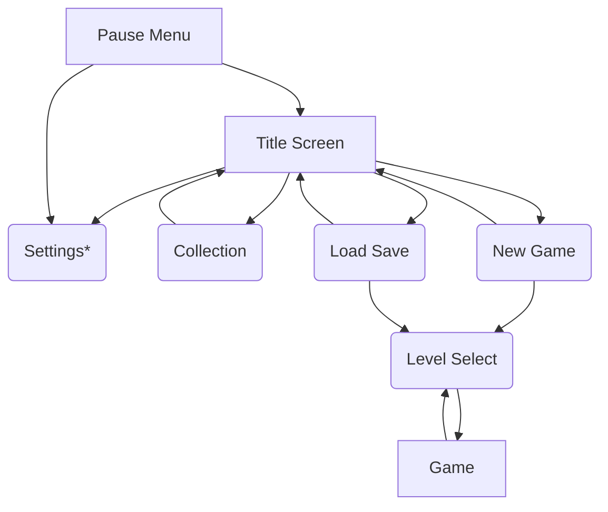

# Menu flowchart
The user can navigate through arrows to get to different menus

\* Settings can go back to whatever menu it was traveled to from

# Menu Item Descriptions
- Title Screen - the home screen with the title and access to all other menus 
- Pause Menu - a menu that can be opened up mid game
- Collection - shows collectables, achievements, etc.
- Load Game - Brings up a dialogue allowing the player to load a previous save and continue to level select.
- Save Game - Brings up a dialogue allowing the player to create a new save file
- Level Select - Allows the player to fast travel to various points in the connected caves.
- Settings - A settings menu for configuring the following:
  - Audio Settings
  - Fullscreen/borderless
  - Control mapping
- Game - A gameplay level

# Menu Item Diagrams
<!-- TODO -->